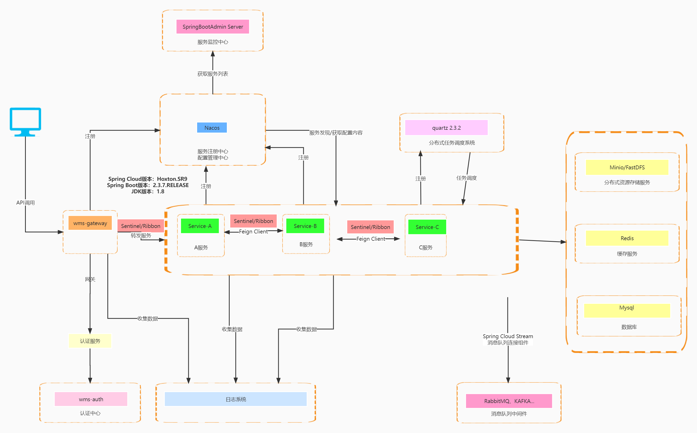
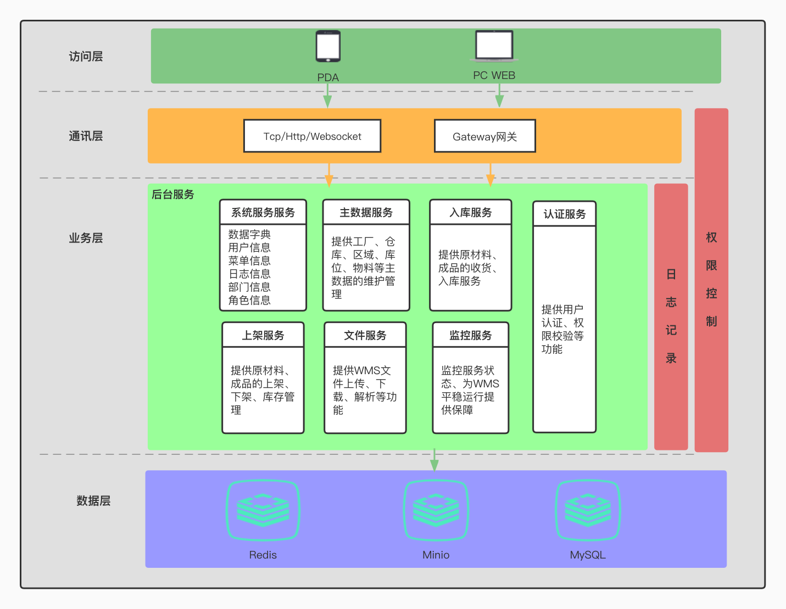

# Nutricia WMS Project  

## 项目介绍  


## 项目技术架构图   


## 项目模块划分  


## 项目流程图  
### 入库流程图  

### 上架流程图  


## 项目部署流程  
项目提供了docker部署，只需要复制jar文件到对应的/wms-cloud/docker/wms目录下。  
```textmate
docker
├── mysql            // 数据库
│       └── db                            // 数据库脚本
│       └── dockerfile                    // mysql dockerfile
├── nacos            // 注册中心/配置中心
│       └── conf                          // nacos 配置文件
│       └── dockerfile                    // nacos dockerfile
├── nginx            // web服务器
│       └── conf                          // nginx 配置文件
│       └── html                          // 打包后的前端ui
│       └── dockerfile                    // nginx dockerfile
├── redis            // 缓存服务
│       └── conf                          // redis 配置文件
│       └── dockerfile                    // redis dockerfile
├── wms              // 业务模块
│       └── auth                          // 认证中心   dockerfile jar
│       └── gateway                       // 网关服务   dockerfile jar
│       └── modules                       // 业务模块   dockerfile jar
│           └── system                    // 系统服务   dockerfile jar
│           └── file                      // 文件服务   dockerfile jar
│           └── masterdata                // 主数据服务  dockerfile jar
│           └── storagein                 // 入库服务   dockerfile jar
│           └── binin                     // 上架服务   dockerfile jar
├── deploy.sh               // 部署脚本
├── docker-compose.yml      // docker-compose
```  
上传文件到服务器（/home/wms/docker），通过deploy.sh执行命令控制。  
严禁删除文件  

```shell
# 开启所需端口,使用华为云服务器不需要执行，华为云服务器需要在控制台进行打开端口
./deploy.sh port

# 启动基础环境（必须），基础环境包括mysql、nacos、redis
./deploy.sh base

# 启动程序模块（必须）
./deploy.sh modules

# 关闭所有环境/模块
./deploy.sh stop

# 删除所有环境/模块
./deploy.sh rm
```  


## git代码提交规范  


